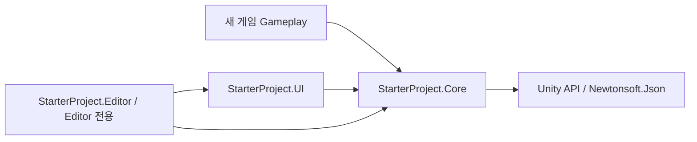

# 공통 기반 설계 점검 — SOLID와 적용 패턴

> **검토 기록:** 2026-10-04/05 당시의 SOLID·확장 계약 점검입니다. 현재 구조는 [아키텍처 기준](INITIAL_SETTING.md), 현재 API는 [실행 기반](PHASE_2_RUNTIME.md)을 따릅니다.

최종 갱신: 2026-10-05. `bfd1929` 기준의 2026-10-04 검토와 후속 3슬롯·Title 메뉴 확장을 함께 기록한다. 최신 기능은 **구현·관련 필수 자동 검증 완료**이다. 목적은 장르 규칙을 강제하지 않는 Unity 스타터다. 캐릭터·스테이지·전투 등의 게임별 구현은 이번 범위에 포함하지 않는다.

## 이 문서의 순서

- [판단](#판단)
- [책임과 의존 관계](#책임과-의존-관계)
- [적용한 디자인 패턴](#적용한-디자인-패턴)
- [확장 계약과 연결 시점](#확장-계약과-연결-시점)
- [2026-10-05 슬롯·Title 확장](#2026-10-05-슬롯title-확장)
- [2026-10-04 보완과 검증](#2026-10-04-보완과-검증)
- [의도된 범위와 과거 근거](#의도된-범위와-과거-근거)

## 판단

현재 규모에서는 책임과 의존 방향이 대체로 적절하다. 저장 위치·실행 설정·게임 payload·화면을 바꾸는 경로가 있고, 예제 화면 검사는 공통 초기화에서 분리됐다. 다만 Core의 언어 제한과 저장 검증 예외 처리에 실제 확장 장애가 있어 보완했다. SOLID를 모든 요구에 대한 완전한 확장성 보장으로 해석하지 않는다.

| 원칙 | 코드 근거 | 판단과 한계 |
| --- | --- | --- |
| S — 단일 책임 | AppBootstrap은 진입, AppRoot는 서비스 조립·수명·요청 조정, SettingsService/GameSessionService는 데이터 정책, JsonRepository는 보호·복구, JsonFileStore는 파일 교체, UI는 표시·입력 | 현재 책임 구분은 적절하다. 서비스가 자기 DTO의 JSON 변환을 소유하는 것은 같은 저장 형식의 변경 이유에 속한다. 같은 파일에 여러 타입이 있는 것 자체를 위반으로 보지 않는다. |
| O — 개방·폐쇄 | ITextFileStore·IRuntimeSettings·GamePayloadPolicy 및 변환/검증 delegate | 언어의 en/ko 고정을 제거해 공통 코드 수정 없이 다른 식별자를 저장한다. 기본 3개 독립 슬롯을 구성할 수 있다. 새 옵션 필드·슬롯 간 복사·다른 시작 흐름은 별도 요구로 설계한다. |
| L — 리스코프 치환 | 저장소의 원본 보호, 실행 설정의 실패 시 복원 시도·Dispose, 반복 가능한 payload 검증 | 기본 구현과 테스트 대체 구현의 계약을 확인한다. 인터페이스를 구현했다는 사실만으로 모든 외부 구현의 대체 가능성이 보장되지는 않는다. 저장 시 FormatException/OverflowException도 데이터 오류 결과로 처리하도록 읽기와 일치시켰다. |
| I — 인터페이스 분리 | ITextFileStore의 읽기/안전 쓰기, 선택적 IDeleteSaveFileStore, IRuntimeSettings의 Apply/Dispose | 새 삭제 요구를 별도 capability로 추가해 기존 읽기·쓰기 대체 구현의 계약을 깨뜨리지 않는다. 삭제 미지원 저장소도 읽기·저장은 사용할 수 있다. |
| D — 의존성 역전 | UI → Core, Editor → Core/UI, Core의 UI·Editor 참조 없음. 서비스는 ITextFileStore에 의존 | AppRoot에서 기본 구현을 생성하는 것은 조립 지점의 역할이다. Core에는 Unity·Newtonsoft 의존성이 남으므로 Unity 밖에서 그대로 쓰는 순수 .NET 라이브러리는 아니다. |

## 책임과 의존 관계

UI 어셈블리는 uGUI·Input System, Editor 어셈블리는 예제 구성용 UI·Input System·URP도 참조한다. 사용자 화면으로 교체해도 Core에 해당 화면 타입을 추가하지 않는다. 프로젝트 템플릿이므로 예제 UI 코드 어셈블리 자체를 삭제할 때에는 Editor 생성 도구의 참조도 정리해야 한다.

| 구성요소 | 소유 책임 | 확장할 때의 기준 |
| --- | --- | --- |
| AppBootstrap / AppConfig | 시작 요청, 세 역할 씬·기본 설정 | Boot·Title·Main은 현재 앱 흐름의 전제. 설정 에셋은 실행 중 상태 저장소로 사용하지 않는다. |
| AppRoot | 서비스 생성·해제, 준비 상태, 씬 전환 차단, 설정 저장과 플랫폼 적용 조정 | 게임 규칙을 추가하지 않는다. 사용자 UI의 요청은 Try* API로 연결한다. |
| SettingsService / UserSettings | 옵션 스냅샷·검증·저장 형식 | 현재 세 필드다. 새 필드는 Copy·검증·JSON 읽기/쓰기·기본값·버전 호환을 함께 다룬다. |
| GameSessionService / GamePayloadPolicy | 슬롯별 저장 정보·하나의 활성 세션·게임 데이터 검증 정책 | 게임별 필드는 payload와 파생 정책에 둔다. payload 버전이 다르면 자동 변환하지 않고 보호한다. |
| JsonRepository<T> | 주 파일/백업 선택, 덮어쓰기 보호, 명시적 복구 | 실제 버전 해석은 서비스의 deserialize 함수가 담당한다. Repository는 해석 결과를 받아 보호·복구한다. |
| JsonFileStore | 파일 크기·경로·임시 쓰기·검증·교체·정확한 저장 파일군 삭제 | 다른 저장소도 아래 계약을 충족해야 한다. 동기 호출을 장시간 네트워크 작업으로 치환하면 사용성이 유지되지 않는다. |
| StarterScreen / StarterTitleMenu / LoadingOverlay / CanvasLayout | 예제 입력·상태 표시, 로딩, 해상도·안전 영역 | 자체 화면은 Core API로 연결한다. 예제에 남는 언어 토글·버튼 배치는 게임 요구에 맞게 교체한다. |

## 적용한 디자인 패턴

| 패턴/구조 | 실제 적용 | 사용 이유와 범위 |
| --- | --- | --- |
| Composition Root + Application Controller | AppRoot | 기본 구현을 조립하고 앱 단위 수명·명령·전환을 조정한다. 전역 서비스 등록소를 제공하는 DI 컨테이너는 아니다. |
| Strategy 형태의 정책 | GamePayloadPolicy, serialize/deserialize/validator delegate | 저장 데이터 규칙을 Core 변경 없이 교체한다. ScriptableObject는 정책 연결 수단이며 실행 세션 상태를 넣지 않는다. |
| Adapter | UnityRuntimeSettings, ITextFileStore의 구현 | Unity 전역 설정과 파일 접근을 별도 경계로 감싸 테스트와 구현 교체를 허용한다. |
| 제한된 Repository 형태 | JsonRepository<T> | 파일 영속화·보호·복구를 공통화한다. 도메인 컬렉션·쿼리·작업 단위까지 제공하는 일반 Repository 전체 구현은 아니다. |
| Observer | AppRoot.StateChanged, SettingsService.Changed | 확정된 상태를 화면·플랫폼에 전달한다. 구독 해제와 콜백 실패 처리는 사용자가 지켜야 할 계약이다. |
| 단일 Unity 실행 인스턴스 | AppRoot.Instance·중복 제거·DontDestroyOnLoad | 한 앱의 한 세션을 조정한다. 모든 클래스를 전역 접근으로 연결하는 근거로 확대하지 않는다. |

AppState enum과 분기는 상태 모델이며 별도 상태 객체를 사용하는 GoF State 패턴은 아니다. GameSession 불변 스냅샷과 UserSettings 방어적 복사는 데이터 소유권 규칙이다. 이를 Memento·Prototype 구현이라고 부르지 않는다. 현재 요구에는 추가 DI 컨테이너·범용 이벤트 버스·상태 클래스 계층을 도입할 근거가 없다.

## 확장 계약과 연결 시점

| 확장 지점 | 연결 시점·수명 | 필수 계약 |
| --- | --- | --- |
| ConfigureStorage(ITextFileStore) | Begin 전 NotStarted에서 교체 가능. 저장소 자원은 주입자 소유 | 없는 파일은 null, IO/권한 오류는 예외. 검증·쓰기 실패 시 기존 주 파일 보존. 정상 교체의 .bak 및 명시적 복구의 원본 별도 보존 지원. AppRoot가 Dispose하지 않음. |
| IDeleteSaveFileStore | fileStore가 구현하거나 GameSessionService 생성자에 별도 전달. 자원 수명은 주입자 소유 | 읽기·쓰기와 같은 논리 저장 위치 사용. 지정 주 파일과 생성된 백업·보존·임시 파일만 삭제. 이미 없으면 성공, 접근 실패는 예외, 보조 파일 먼저·주 파일 마지막. |
| ConfigureRuntimeSettings(IRuntimeSettings) | Begin 전 1회. AppRoot가 해제 책임 소유 | Apply 실패 시 직전 실행 상태 복원을 시도하고 실패를 예외로 알림. Dispose는 최초 상태 복원·중복 해제 안전성을 제공. |
| GamePayloadPolicy | Boot AppBootstrap Inspector 또는 Begin 전 ConfigureGamePayload | Inspector 또는 수동 연결 중 한 경로만 사용. JSON 객체 초기값, 양수 버전, 부작용 없이 반복 가능한 검증. 플레이 도중 정책 에셋을 변경하지 않음. |
| 사용자 UI | 준비 상태를 확인한 뒤 AppRoot.Try* 사용 | Settings.Current는 복사본, Game.Current는 읽기 전용 스냅샷. Game/Settings의 저수준 메서드를 직접 호출하면 앱의 씬 차단·플랫폼 적용 조정을 우회할 수 있음. |

일반 Player에서 저장소나 실행 설정을 교체하려면 Boot 씬의 활성 오브젝트에 단일 연결 컴포넌트를 두고 Awake에서 AppRoot를 찾거나 생성해 Configure*를 호출한다. AppBootstrap.Start가 Begin을 담당한다. 기존 루트의 State가 NotStarted일 때만 Configure*를 호출하며, Boot 재진입의 Ready 루트는 다시 구성하지 않는다. 여러 컴포넌트의 Awake 순서에 의존하지 않도록 조립을 한곳에 모은다. 이는 활성 씬 오브젝트의 Awake가 Start보다 앞서는 Unity 수명 주기를 사용한다. [Unity Awake 실행 순서](https://docs.unity3d.com/6000.3/Documentation/ScriptReference/MonoBehaviour.Awake.html)

Editor의 Main 직접 Play는 Boot 시작 전에 저장소를 개발용 격리 경로로 바꾼다. 따라서 일반 Player용 저장소를 주입하더라도 이 개발 경로가 해당 저장소의 동작을 검증하는 것은 아니다.

payload의 예상 가능한 데이터 오류는 JsonException·InvalidDataException·FormatException·OverflowException으로 알린다. 검증기는 읽기와 저장 중 여러 번 실행되므로 재화 차감·상태 갱신·로그인 요청 같은 부작용을 넣지 않는다. 나머지 코드 결함 예외까지 일반적인 저장 실패로 숨기지 않는다.

StateChanged와 Changed는 호출 스레드에서 동기 실행되며 앱 API는 Unity 메인 스레드에서 사용한다. 구독자는 OnDisable/OnDestroy에서 해제하고 자체 작업의 예외를 처리한다. 구독자 예외는 자동 격리하지 않는다. 비동기 씬 이동의 Try*가 true이면 요청을 접수했다는 뜻이며, 화면 준비는 Ready와 !IsTransitioning 및 실제 목적 씬을 함께 확인한다. 저장 Try*는 동기 결과이며 성공 여부는 반환 bool로 판단한다. StorageStatus는 저장 파일을 읽어 판정한 상태로, 유효 파일을 가진 Loaded 상태에서도 새 payload 저장이 실패할 수 있다. 안내 문자열 자체를 프로그램 계약으로 파싱하지 않는다.

## 2026-10-05 슬롯·Title 확장

기본 3개 독립 슬롯과 `CurrentSlotId`로 하나의 활성 세션을 연결한다. `Slots`는 불변 항목을 담은 읽기 전용 스냅샷이며 갱신 후 다시 조회한다. `AnyCanContinue`는 전체 슬롯의 진입 가능성을, 기존 `CanContinue`/`Status`는 활성 슬롯 또는 슬롯 1을 나타낸다. `StartNew`/`TryContinue`의 슬롯 없는 호출은 슬롯 1 호환성을 유지한다.

AppRoot의 명시적 슬롯 시작은 Title의 빈 슬롯만 허용하고, 삭제·복구도 Title에서 활성 진행이 없을 때 요청한다. 저수준 서비스의 활성 슬롯 삭제 차단과 파일 저장소의 경로·파일군 검증을 함께 적용한다. Title의 `StarterTitleMenu`는 새 게임·이어하기·관리·설정·제작진·삭제 확인을 표시하지만 저장 규칙이나 실제 파일 접근을 소유하지 않는다. `IDeleteSaveFileStore`가 없으면 삭제만 비활성화한다.

저장소는 `.bak`과 N형 GUID의 보존·임시 파일을 먼저 지우고 주 파일을 마지막에 지운다. 실패 시 일부 보조 파일이 제거되었을 수 있으므로 삭제를 전체 롤백 가능한 트랜잭션으로 표현하지 않는다. 기존 슬롯 1의 파일 형식과 설정 공통 저장은 유지한다. **구현·관련 필수 자동 검증 완료**이며 아래의 2026-10-04 결과를 새 슬롯 기능의 통과 근거로 재사용하지 않는다. [공개 API·삭제 계약](SETTINGS_AND_SAVE.md)

## 2026-10-04 보완과 검증

- 언어 식별자를 최대 64자, 비어 있지 않고 공백·제어 문자가 없는 값으로 통일했다. Core는 지원 언어 목록·번역 유무를 판단하지 않는다. 기본 예제의 en/ko 토글은 유지한다. settings schemaVersion 1과 기존 en/ko 저장은 호환된다.
- 쓰기 검증기의 FormatException·OverflowException은 실패 결과로 반환하고 기존 저장·세션을 유지한다. 읽기의 Invalid 처리와 일치한다.
- 공개 저장소·payload 정책의 반복성·오류·수명 계약을 보강했다.
- Unity 6000.3.16f1에서 PersistenceTests·RuntimeSettingsTests **57/57 통과, 실패·건너뜀 0개**. 새 언어·잘못된 값·길이 경계·변환 예외·원본 보호·코드 결함 예외 전파를 포함한다. 결과는 `Logs/SolidContractsEditMode.xml`·`.log`다. 저장소는 임시 경로로 격리했다. GUI·새 Player 빌드·모바일 실기기 범위는 늘리지 않았다.

## 의도된 범위와 과거 근거

현재 구현은 단일 AppRoot·활성 세션, 기본 3개 독립 슬롯, Boot/Title/Main 앱 흐름, 동기 메인 스레드 저장, 파일당 1MiB·JSON 깊이 32, uGUI 예제·새 Input System이다. 서비스의 슬롯 수는 1~10 범위로 구성할 수 있지만 기본 AppRoot·예제 UI는 3개다. 별도 사용자 프로필·슬롯 복사·비동기 클라우드·Addressables 씬·새 설정 스키마·payload 마이그레이션은 게임의 실제 요구가 정해질 때 설계한다.

2026-09-23 당시 EditMode 46개·PlayMode 27개, Windows 빌드·별도 프로세스 저장/이어하기가 통과했다. 2026-10-04 직전 UI 재사용 보완은 EditMode 18개 항목과 PlayMode 27개를 확인했다. 이 수치를 이번 변경의 새 실행 결과로 재사용하지 않는다. 상세 기록은 [통합 검증](INTEGRATION_VALIDATION.md), [이전 재사용성 검토](REUSABILITY_REVIEW.md), [Summary](PRESET_SUMMARY.md)를 따른다.
