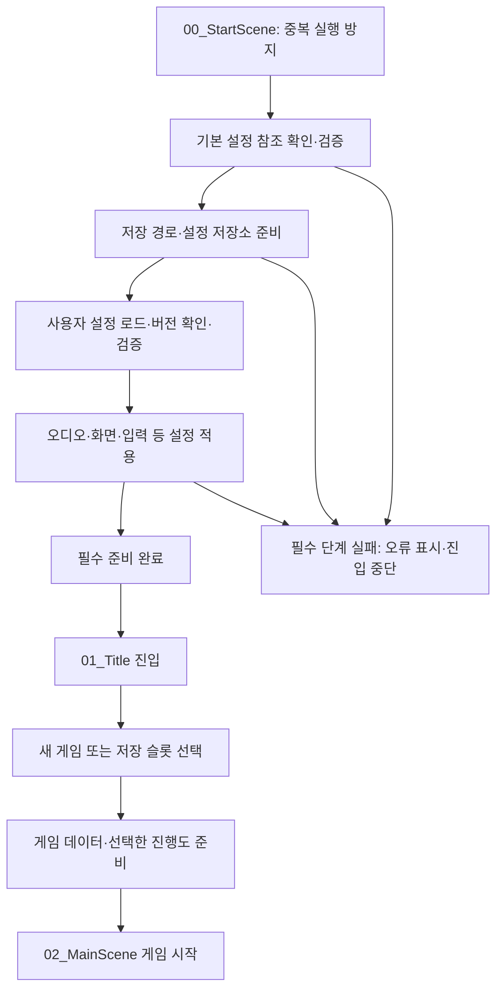

# Initial Setting — 초기화와 데이터 관리 설계

작성일: 2026-09-07 · 상태: 설계 초안 · 구현: 미착수

## 1. 확정 범위와 제안 구분

**사용자 확정 사항**

- 앞으로 만들 게임에서 재사용할 Starter Project를 만든다.
- 오프라인 게임 공통 기반으로 시작하고 온라인 기능은 필요할 때 추가한다.
- 이번 단계에서는 설계와 기준을 정리한다.
- 현재 변경된 폴더 구조를 바탕으로 작업한다.

**이 문서의 기술 선택은 검토할 추천안이다.** SO·JSON 혼합, Boot 진입점, 서비스 구성, 저장 정책, 배포 방식은 아직 사용자 확정 또는 구현 완료 상태가 아니다.

공통 기반의 목표는 게임을 만들기 전에 반복하는 작업을 줄이는 것이다. 전투, 인벤토리, 퀘스트, 스테이지 같은 게임 규칙까지 미리 프레임워크로 만들지는 않는다.

## 2. 프로젝트 확인 결과

| 항목 | 현재 상태 | 설계에 주는 의미 |
| --- | --- | --- |
| Unity | 6000.3.16f1 | 같은 버전에서 초기 구현·검증 |
| 렌더링 | URP 2D 17.3.0 | 첫 프리셋의 렌더링 대상은 2D; 3D는 별도 구성 필요 |
| 입력 | Input System 1.19.0, 액션 에셋 존재 | 기존 입력 에셋을 확인하며 확장 |
| 테스트 | Test Framework 1.6.0 설치 | 초기화·저장 구현 때 필요한 테스트 추가 |
| 스크립트 | C# 파일 없음 | 기존 실행 구조와 충돌 없이 설계 가능 |
| 씬 | Boot/00_StartScene, Main/01_Title, Main/02_MainScene | 씬 역할을 분리할 기반 존재 |
| 빌드 씬 목록 | 02_MainScene만 등록 | Boot 구현 시 목록과 시작 순서 수정 필요 |
| 제품 정보 | Product Name 및 Cloud 프로젝트에 Project_DE 흔적 | 템플릿 출시 전 식별 정보 정리 필요 |
| 폴더 문서 | 이전 프로젝트명 및 일부 실제 구조와 차이 | Starter Project 기준으로 문서 보정 |

이 표는 파일 확인 결과이며 Unity 실행 검증 결과가 아니다.

## 3. 데이터 기준: SO와 JSON의 역할 분리 제안

SO는 Unity 안에서 편집하고 에셋을 연결하는 데 사용하고, JSON은 실행 후에도 보관할 값을 저장하거나 외부 데이터를 교환하는 데 사용한다.

| 데이터 종류 | 기본 방식 | 예시·소유 위치 | 변경 규칙 |
| --- | --- | --- | --- |
| 앱 기본 설정 | SO | 시작 설정, 기본 음량, 옵션 기본값 / 04_Data/Config | 개발 중 편집, 실행 중 원본 보존 |
| 에셋 참조·소규모 콘텐츠 정의 | SO | 프리팹·아이콘·오디오 연결 / 04_Data의 기능별 폴더 | 개별 게임에서 추가 |
| 사용자 환경설정 | JSON | 음량·화면·언어 선택 / persistentDataPath | 사용자가 변경한 값 저장 |
| 게임 진행 저장 | JSON | 슬롯·진행도·콘텐츠 ID / persistentDataPath | 저장 기반만 공통화, 진행 필드는 게임별 정의 |
| 실행 중 상태 | 일반 C# 객체 | 현재 상태와 설정 복사본 | 메모리에서 변경하고 필요한 값만 저장 |
| 대량 밸런스 표·외부 공급 데이터 | JSON/CSV 검토 | 향후 테이블·서버 데이터 | 필요가 생긴 시점에 도입 |

`04_Data/Config` 등은 앞으로 실제 파일이 생길 때 만들 위치이며 현재 생성된 폴더가 아니다.

**대안 비교**

- SO 중심: Inspector 편집과 Unity 에셋 참조가 편하다. 사용자 저장 파일은 별도 방식이 필요하다.
- JSON 중심: 외부 편집과 데이터 교환에 유리하다. Unity 에셋 참조를 ID로 연결하는 추가 처리가 필요하다.
- 혼합 방식(추천): 기본 설정과 사용자 변경 값을 구분하기 쉽다. 같은 값을 SO·JSON 양쪽에서 원본으로 관리하지 않도록 책임을 정해야 한다.

**원본과 우선순위**

1. SO 기본값으로 실행용 설정 객체를 만든다.
2. 지원 버전의 사용자 JSON을 읽고, 허용된 사용자 설정 필드만 적용한다.
3. 범위·필수 값·상호 조건을 검증한 후 시스템에 반영한다.

유효한 사용자 설정은 SO 기본값보다 우선한다. 잘못된 필드는 해당 기본값으로 복구하고 기록한다. 게임의 필수 구성이나 에셋 참조를 사용자 설정 파일로 덮어쓰지 않는다. 부분 JSON은 필드 부재와 유효한 `0`·`false`를 구분해야 한다.

SO는 공유 원본 데이터로 취급하고 플레이 중 변경은 실행용 객체에서 처리한다. 여러 소비자가 SO 하나를 공유할 수 있으므로 실행 상태를 원본에 섞지 않는 것이 이 프로젝트의 설계 원칙이다. [Unity ScriptableObject 문서](https://docs.unity3d.com/6000.3/Documentation/Manual/class-ScriptableObject.html)

JSON 직렬화는 단순한 저장용 클래스를 사용하는 `JsonUtility`를 첫 후보로 한다. 필드 기반이며 Dictionary를 직접 지원하지 않으므로, 딕셔너리·복잡한 다형성·외부 JSON 구조가 필요해지면 전용 JSON 라이브러리를 검토한다. 직렬화 가능한 타입과 게임 도메인 모델을 반드시 동일하게 만들 필요는 없다. [Unity JSON 문서](https://docs.unity3d.com/6000.3/Documentation/Manual/json-serialization.html)

## 4. 초기화 순서 제안

Boot 씬의 단일 진입점이 초기화 순서를 명시적으로 실행한다. 각 Manager가 서로의 `Awake` 실행을 가정하지 않는다. Unity는 서로 다른 GameObject 사이의 Awake 순서를 보장하지 않는다. [Unity Awake 문서](https://docs.unity3d.com/6000.3/Documentation/ScriptReference/MonoBehaviour.Awake.html)

사용자 설정 오류의 기본값 복구 등 세부 분기는 아래 오류 정책을 따른다. 모든 단계에서 실패를 포착하되 복구 가능한 오류와 필수 실패를 구분한다.

**앱 초기화와 게임 시작을 분리한다.** Boot에서는 타이틀에 필요한 설정·공통 기능만 준비한다. 특정 저장 슬롯 복원, 스테이지 데이터 로드와 캐릭터 생성은 새 게임·이어하기를 선택한 뒤 진행한다. 타이틀 진입에 필요한 저장 목록 정보는 전체 진행 데이터와 별도로 읽을 수 있다.

타이틀이 없는 게임은 준비 완료 후 프로젝트별 시작 흐름으로 연결한다. 큰 에셋이나 모든 게임 데이터를 부팅 때 한꺼번에 불러오지 않는다.

### 초기화 상태와 수명

- 상태는 `NotStarted → Initializing → Ready` 또는 `Failed`로 구분한다.
- 필수 단계 완료 전에는 타이틀 진입과 게임 시작을 허용하지 않는다.
- 순서가 필요한 단계는 완료를 기다린 뒤 다음 단계를 실행한다. 비동기 작업을 호출만 하고 넘어가지 않는다.
- 중복 Boot 진입 시 서비스와 이벤트 구독을 다시 만들지 않는다.
- 실패·취소 시 이미 준비한 자원을 역순으로 정리한다. 재시도는 이전 실행 정리가 끝난 뒤 수행한다.
- 씬 전환 동안 유지할 공통 객체는 하나의 앱 루트에서 소유한다. 씬별 객체는 해당 씬에서 정리한다.
- Editor Play 반복 실행 시 정적 상태와 이벤트 구독이 남지 않는지 검증한다.

## 5. 최소 구성과 책임 제안

아래 이름은 책임 설명을 위한 후보이며 생성된 클래스 목록이 아니다.

| 구성 | 책임 | 맡기지 않을 일 |
| --- | --- | --- |
| AppBootstrap | 초기화 호출 순서, 상태·실패 관리 | 전투·저장 데이터의 게임 규칙 |
| AppConfig (SO) | 기본 설정 및 필요한 Unity 에셋 참조 | 사용자 플레이 기록 |
| SettingsService | 사용자 설정 로드·검증·변경·저장 | 게임 진행도 관리 |
| 저장소 경계 | 파일 읽기·쓰기와 직렬화 연결 | 저장할 게임 데이터의 의미 판단 |
| 씬 전환 담당 | 전환 중복 방지, 로딩 상태, 진입 조건 | 게임 승패 판단 |
| 게임별 시작 흐름 | 새 게임 생성·선택 슬롯 복원 | 공통 앱 초기화 재실행 |

처음부터 범용 DI 프레임워크나 거대한 Service Locator를 추가하지 않는다. Bootstrap이 필요한 객체를 만들고 참조를 전달하는 방식부터 시작한다. 인터페이스는 저장소처럼 교체·테스트할 실제 경계에 도입한다. 모든 클래스를 Singleton Manager로 만들지 않는다.

코드 위치는 `02_Scripts/Core`의 기능별 하위 폴더, Editor 전용 도구는 `02_Scripts/Editor`, 게임별 규칙은 `02_Scripts/Gameplay`로 한다. 기존의 asmdef 보류 원칙을 유지하되 테스트 어셈블리 구성이 필요하면 구현 단계에서 최소 범위를 검토한다.

## 6. 데이터를 가져오는 경로 제안

- 기본 SO: Boot 컴포넌트나 설정 에셋의 Inspector 참조에서 시작한다. 참조된 필수 에셋의 누락은 사전 검증 대상으로 삼는다.
- 사용자 JSON: 파일 저장소가 `Application.persistentDataPath` 아래 앱의 파일을 읽는다. `Assets`나 설치 폴더에 저장하지 않는다. 실제 위치와 지원은 플랫폼마다 다르므로 첫 출시 플랫폼에서 검증한다. [Unity 저장 경로 문서](https://docs.unity3d.com/6000.3/Documentation/ScriptReference/Application-persistentDataPath.html)
- 작은 번들 JSON이 필요할 때: `TextAsset` 직접 참조를 우선 검토한다. 실제 요구가 생기기 전에는 별도의 JSON 샘플을 강제로 추가하지 않는다.
- Addressables: 다운로드·메모리 관리·대규모 콘텐츠 요구가 생길 때 도입한다. 에셋의 기존 폴더 위치와 로딩 방식은 별개로 다룬다.
- 서버: 향후 원격 공급자를 추가하더라도 읽기 → 버전 확인 → 변환 → 검증 → 사용 가능한 데이터 제공 순서를 유지한다. 로그인·재시도·시간 제한·캐시 정책은 온라인 도입 시 별도 설계한다.

JSON은 데이터 표현 형식이고 SO는 Unity 데이터 에셋이다. 둘 중 하나를 정했다고 로딩 시점·파일 위치·실패 정책까지 자동으로 정해지는 것은 아니다.

## 7. 저장 및 오류 정책 제안

사용자 설정과 게임 진행 저장은 별도 파일·별도 버전으로 관리한다. 각 형식에는 `schemaVersion`을 둔다. 게임 저장에서 에셋은 실행 중 Instance ID 대신 게임에서 관리하는 안정적인 콘텐츠 ID로 표현한다.

| 상황 | 추천 동작 |
| --- | --- |
| 설정 파일 없음 | 기본 설정으로 시작; 첫 실행은 정상 상태 |
| 설정 값 일부 오류 | 잘못된 값만 기본값으로 복구하고 진단 기록 |
| 설정 JSON 파손 | 원본을 보존하고 기본 설정으로 시작; 사용자에게 복구 사실 안내 |
| 이전 지원 버전 | 단계별 마이그레이션 후 검증; 성공 전 원본 보존 |
| 앱보다 새로운 저장 버전 | 호환 불가로 알리고 원본·자동 저장 보호; 구버전으로 덮어쓰지 않음 |
| 게임 진행 파일 파손 | 백업 복구 또는 사용자 선택; 임의로 새 게임 저장으로 덮어쓰지 않음 |
| 저장 권한·용량 문제 | 실패를 알리고 기존 저장 유지; 저장 완료로 표시하지 않음 |
| 필수 SO·에셋 누락 | Boot 실패 처리, 원인 표시, 다음 씬 진입 중단 |
| 중복 초기화·전환 | 진행 중 작업에 합류하거나 중복 요청 거절 |

설정 저장은 변경 확정 시 수행한다. 게임 진행 저장 시점은 게임마다 정하고, 종료 콜백에만 의존하지 않는다. 저장 중 중복 요청은 직렬화하고, 임시 파일 쓰기 → 검증 → 백업/교체 순서로 기존 저장을 보호한다. 파일 교체의 보장은 플랫폼·파일 시스템별로 검증하며 전 플랫폼에서 원자적이라고 가정하지 않는다.

## 8. 구현 순서와 완료 기준 제안

1. **Boot 최소 흐름**: 기본 SO 검증 → Ready → Title을 연결한다. 중복 실행·필수 설정 누락·실패 시 정지 확인.
2. **사용자 설정**: 기본값 복사·JSON 로드·검증·설정 적용·저장. 첫 실행, 파손 파일, 재실행 복원 확인.
3. **씬 전환**: 타이틀과 게임 진입을 분리하고 중복 전환 방지. Main에서 바로 Play하는 개발 경로도 정한다.
4. **저장 기반**: 버전·백업·복구·쓰기 실패를 다룬다. 실제 게임 진행 데이터는 게임별 확장으로 남긴다.
5. **복제·배포 검증**: 깨끗한 복제본에서 Unity 열기·Play·빌드·저장 복원을 확인한다.

세부 테스트와 출시 기준은 [체크리스트](TEMPLATE_CHECKLIST.md)를 따른다. 이 순서는 향후 구현 계획이며 이번 문서 작업에서 통과한 검증이 아니다.

## 9. 다음 결정 항목

| 항목 | 추천 출발점 | 상태 |
| --- | --- | --- |
| SO / JSON 분담 | 기본값·참조는 SO, 사용자 설정·진행 저장은 JSON | 제안 |
| 초기화 진입점 | Boot 씬 + 명시적인 순차 초기화 | 제안 |
| 첫 지원 플랫폼 | Windows PC에서 기준 검증, 모바일·Web은 요구에 따라 추가 | 미정 |
| 화면 UI | uGUI / UI Toolkit 중 프로젝트 작업 방식에 맞춰 선택 | 미정 |
| Main 씬에서 바로 Play | Editor에서 Boot를 경유하고 원래 목표 씬으로 진입 | 제안 |
| 비동기 구현 수단 | Unity 기본 수단을 우선 검토, 취소·예외 처리 포함 | 미정 |
| 템플릿 배포 | GitHub Template Repository부터 시작 | 제안 |
| 온라인·Addressables·DI | 실제 필요가 생길 때 추가 | 제안 |

SO·JSON 분담과 초기화 흐름을 먼저 확정하면 다음 단계는 **Boot 최소 흐름 구현**이다.
