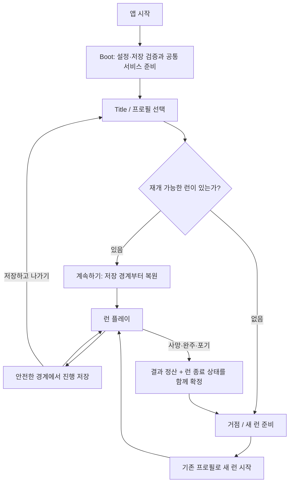

# 로그라이크·로그라이트 시작·이어하기·저장 흐름 사전 조사

> **장르 참고 조사:** 당시 사례·제안이며 공통 프리셋의 저장·사망·성장 규칙을 정하지 않습니다. 현재 사용법은 [새 게임 가이드](NEW_GAME_SETUP.md)를 따릅니다.

조사일: 2026-09-23 · 상태: **장르 사례 연구 / 범용 프리셋 경계 검토 완료** · 대상 사례: 오프라인 싱글플레이 로그라이크·로그라이트

사용자 요청에 따라 실제 게임 사례를 중심으로, 플레이 편의와 런의 긴장감을 함께 지키는 방법을 조사했다. 현재 Starter Project의 6단계인 Main 직접 Play·설정 검증·테스트 데이터 도구에 적용할 기준까지 정리한다. **아래 플레이어용 권장안은 이 장르의 게임을 만들 때 검토할 예시이며 프리셋의 기본 규칙이 아니다.** 공통 템플릿은 장르 독립성을 유지한다.

## 이 문서의 순서

- [1. 이 장르의 게임에 대한 권장안과 프리셋 적용 범위](#1-이-장르의-게임에-대한-권장안과-프리셋-적용-범위)
- [2. 실제 게임은 어떻게 사용하는가](#2-실제-게임은-어떻게-사용하는가)
- [3. 플레이 관점에서 어떤 선택이 유리한가](#3-플레이-관점에서-어떤-선택이-유리한가)
- [4. 권장 플레이 흐름과 저장 경계](#4-권장-플레이-흐름과-저장-경계)
- [5. 현재 코드와의 차이](#5-현재-코드와의-차이)
- [6. 다음 6단계에 적용할 개발 진입 방식](#6-다음-6단계에-적용할-개발-진입-방식)
- [7. 검증 시나리오와 남은 결정](#7-검증-시나리오와-남은-결정)
- [8. 출처와 조사 한계](#8-출처와-조사-한계)

## 1. 이 장르의 게임에 대한 권장안과 프리셋 적용 범위

**로그라이트 게임의 플레이어용 흐름은 ‘프로필 유지 + 현재 런 이어하기’를 검토하고, 범용 프리셋의 개발용 직접 Play는 ‘Boot 초기화 + 격리된 새 테스트 세션’을 기본으로 제안한다.** 저장 복사본 재현은 게임별 데이터 모델이 준비된 뒤 확장할 수 있다.

1. **새 런과 새 프로필을 분리한다.** 죽거나 새 런을 시작해도 유지할 성장·해금·기록을 명확하게 정의한다. 영구 능력치 성장이 없는 게임에서도 통계·옵션과 현재 런은 구분할 수 있다.
2. **중단 후 이어하기와 사망 후 재도전을 별도 정책으로 둔다.** 일상적인 중단을 허용하면서도 런 실패의 결과는 유지할 수 있다. 사망 재도전은 게임의 기본 규칙 또는 명시적인 보조 모드로 결정한다.
3. **액션 로그라이트의 첫 구현 후보는 안전한 경계의 자동 저장이다.** 방·구역 완료와 보상 확정 같은 시점에 저장하고, 종료 메뉴에서 돌아올 위치를 알려준다. 전투 도중 정확한 순간 복원은 게임 상태 복원 비용을 검토한 뒤 선택한다.
4. **Main 직접 Play는 초기화를 모두 거친다.** 반복 작업에서 생략할 대상은 타이틀 조작이다. 저장·설정·입력·공통 서비스 준비와 실패 검증은 실제 실행 경로를 재사용한다.

1~3번은 게임별 `Gameplay`의 설계 선택이다. 범용 프리셋에 적용할 공통 기반은 4번의 초기화·격리·검증 경로뿐이다. 이는 아래 사례와 현재 코드에 근거한 설계 판단이며, 매출·유지율·만족도 비교 실험 결과가 아니다.

## 2. 실제 게임은 어떻게 사용하는가

공식 개발사 설명·패치 노트·공개 매뉴얼을 우선했다. 패치 자료는 **해당 시점에 확인된 설계 사례**로 사용하며, 모든 플랫폼의 2026년 최신 동작으로 일반화하지 않는다. 각 게임을 직접 설치해 플레이하거나 내부 저장 형식을 분석한 조사는 아니다.

| 게임 / 확인 범위 | 공식 자료에서 확인한 동작 | 플레이 관점의 해석 | 프로젝트에 가져올 기준 |
| --- | --- | --- | --- |
| **Returnal** / PS5 2.0, 2021-10-26 | Suspend Cycle로 게임·콘솔을 종료한 뒤 이어갈 수 있다. 재개하면 해당 중단 지점은 소모된다. 보스전·격렬한 전투 등에서는 중단 지점을 만들 수 없다. [공식 발표](https://blog.playstation.com/2021/10/26/returnal-2-0-update-brings-suspend-cycle-and-photo-mode/) | 긴 런을 한 번에 끝내야 하는 부담을 줄이면서, 같은 저장으로 반복 재도전하는 범위는 제한한다. 중단 불가 구간은 여전히 제약이다. | 중단 저장의 사용 가능 시점과 재개 규칙을 UI에 명시한다. 일회성이라는 사용자 규칙을 파일 삭제 순서로 단순 모방하지 않는다. |
| **Hades** / FAQ, 2025-07-16 갱신 | 영구 진행 시스템, 반복 플레이 속 이야기 전개, 난이도 조정과 God Mode를 제공한다. God Mode는 피해 저항을 높이고 사망할 때 더 강해진다. [개발사 FAQ](https://www.supergiantgames.com/blog/hades-faq/) | 실패 후에도 다음 시도를 기대하게 하는 성장·이야기와 난이도 선택을 함께 설계한다. | 런 수명과 장기 진행 수명을 분리한다. 이 FAQ만으로 방별 저장 시점이나 종료 시 롤백 범위를 단정하지 않는다. |
| **Dead Cells** / Update 29, 2022-04~07 | Assist Mode의 Continue는 사망 시 바이옴 시작부터 부활하게 한다. 이후 재도전 횟수도 설정할 수 있게 했다. [공식 패치 노트](https://dead-cells.com/patchnotes/29) | 실패 구간 연습과 접근성을 위한 선택을 제공한다. 일반적인 ‘앱 종료 후 이어하기’와 목적이 다르다. | 보조 재도전과 중단 저장을 같은 Continue 기능으로 뭉치지 않는다. 기본 사망 규칙과 예외를 별도로 기록한다. |
| **Slay the Spire** / PC Weekly Patch 37, 2018-08-09 | 여러 저장 슬롯이 각자의 진행·플레이 시간·선호 설정을 관리한다. 프로필 삭제로 다시 시작할 수 있지만 Steam 도전 과제는 삭제되지 않는다. [개발사 공지](https://store.steampowered.com/news/posts/?appids=646570&enddate=1534470007&feed=steam_community_announcements) | 다른 사람이 플레이하거나 새로 시작해도 기존 진행·연승 기록을 분리할 수 있다. | 프로필 초기화와 런 재시작을 구분한다. 이 사례는 전투 중 저장·재시작 규칙을 입증하는 자료가 아니다. |
| **Rogue Legacy 2** / 개발사 게임 소개 | 무작위 런과 바뀌는 캐릭터 위에 영구 업그레이드를 두며, 부모의 유산으로 가문 저택을 성장시켜 후대에 도움을 준다. [개발사 소개](https://www.cellardoorgames.com/) | 개별 캐릭터의 죽음과 장기 성장의 지속이 함께 성립한다. 반면 성장 단계가 다르면 같은 구간의 난이도 비교가 달라진다. | 테스트 프리셋에 캐릭터만이 아니라 영구 성장 상태도 포함한다. |
| **Dungeon Crawl Stone Soup** / 공식 저장소 master 매뉴얼, 조회일 기준 | 저장 후 종료 명령과 저장 없이 종료 명령을 구분하고, 시작 화면에서 저장된 게임을 이어간다. 사용자 지정 시드와 Arena 모드도 제공한다. [공식 매뉴얼](https://github.com/crawl/crawl/blob/master/crawl-ref/docs/crawl_manual.rst) | 전통적 로그라이크에서도 중단·재개와 조건을 지정하는 플레이를 지원하는 사례다. | 저장하고 나가기와 포기하기를 분리한다. 시드·시나리오 지정은 별도 테스트 진입의 참고가 된다. |

DCSS 공식 FAQ는 버그 조사에 저장 파일과 재현 절차가 유용하며 Wizard Mode로 재현할 수 있다고 안내한다. 실제 게임에서 테스트 편의 경로를 제공하는 공개 사례다. 다만 이것이 상용 게임들의 Unity 씬 구성이나 개발용 Boot 구현이 같다는 증거는 아니다. [DCSS FAQ, Q14](https://crawl.develz.org/wordpress/faq)

**사례를 함께 보면:** 게임마다 영구 성장과 사망 페널티는 다르지만, ‘이번 시도를 끝낸다’, ‘잠시 나간다’, ‘전체 진행을 새로 만든다’는 서로 다른 의도다. 이 의도들을 저장 버튼 하나로 처리하는 것보다 분리하는 편이 플레이어가 잃는 것을 이해하기 쉽다.

## 3. 플레이 관점에서 어떤 선택이 유리한가

### 저장·중단 방식 비교

아래 장단점은 설계상 예상 효과다. 자동 저장은 **저장 시점**, 중단 저장은 **재개 용도**, 영구 죽음은 **실패 규칙**에 관한 선택이므로 함께 사용할 수 있다.

| 방식 | 유리한 상황 | 플레이상의 비용 | 이번 프로젝트에 대한 판단 |
| --- | --- | --- | --- |
| 런 중 저장 없이 끝까지 플레이 | 매우 짧은 런, 한 세션 완주 자체가 목표인 모드 | 호출·외출·기기 종료가 게임 내 실패와 비슷한 손실을 만든다 | 장르 공통 기본값으로 고정하지 않는다 |
| 자유로운 수동 저장·불러오기 | 실험·연습·사용자 주도 되돌리기가 목표 | 결과를 보고 되돌리는 행동이 최적 전략이 될 수 있다 | 연습 모드 등 의도가 있을 때 채택 |
| 방·구역 경계 자동 저장 | 실시간 액션, 상태가 안정되는 경계가 명확한 게임 | 마지막 경계 이후 진행은 재수행할 수 있으며 경계가 멀면 부담이 커진다 | 액션 로그라이트의 우선 구현 후보. 정확한 경계는 게임 규칙에서 결정 |
| 현재 상태를 보존하는 중단 저장 | 긴 런, 중간에 나가야 하는 플레이어 | 전투·물리·AI·효과 상태까지 복원하려면 복잡해진다. 안전 구간 제한 시 즉시 종료 편의가 줄어든다 | 경험상 유리하지만 정확한 순간 복원은 별도 비용 검토 |
| 사망 후 구간 재도전 | 접근성, 학습, 반복 숙련 | 기본 런 실패 규칙과 다른 경험을 만든다 | Dead Cells처럼 명시적 보조 정책으로 검토 |

턴제·덱빌딩은 명령 처리 완료나 보상 선택 완료를 저장 후보로 삼을 수 있다. 실시간 액션은 전투 중 순간 복원보다 구역 전환 같은 안정된 경계를 먼저 검토할 수 있다. 이는 구현 제안이며 Slay the Spire나 Hades의 실제 저장 알고리즘에 대한 주장이 아니다.

### 성장 구조와 시작 버튼

**영구 성장 중심 로그라이트**에서는 ‘새 런’이 기존 프로필의 해금·성장 상태를 사용해야 한다. ‘처음부터’가 프로필까지 초기화한다면 별도 위치에서 무엇이 삭제되는지 알리고 확인받는다. Hades·Rogue Legacy 2의 사례가 이 분리를 뒷받침한다.

**영구 능력치 성장을 두지 않는 설계**라면 반복 도전의 공정한 초기 조건과 플레이어의 숙련에 무게를 둘 수 있다. 영구 성장의 장점은 실패 후 보상감을 만들 수 있다는 점이고, 비용은 반복 횟수에 따라 난이도가 달라져 실력 비교와 밸런스 검증이 복잡해진다는 점이다. 어느 쪽도 장르 이름만으로 자동 선택하지 않는다.

권장 메뉴 의미는 다음과 같다. 실제 문구와 화면은 게임별로 정한다.

| 의도 | 유지할 것 | 끝내거나 바꿀 것 |
| --- | --- | --- |
| 계속하기 | 현재 프로필과 재개 가능한 런 | 없음 |
| 새 런 | 프로필 성장·해금·설정 | 기존 활성 런이 있으면 포기 확인 후 교체 |
| 저장하고 나가기 | 저장 성공한 프로필·런 | 현재 실행만 종료. 저장 실패 시 성공한 것처럼 이동하지 않음 |
| 런 포기 | 게임이 정한 영구 진행 | 현재 런 종료. 보상 정산 여부는 별도 규칙 |
| 프로필 초기화 | 계정·플랫폼 도전 과제 등의 유지 범위를 별도로 안내 | 선택한 프로필의 진행 데이터 |

재개 가능한 런이 없지만 프로필이 있으면 ‘거점으로’ 또는 ‘새 런’을 제공한다. ‘계속하기’를 거점 복귀까지 포함하는 이름으로 사용해도 되지만, 버튼이 실제로 어디로 이동하는지 일관되게 보여줘야 한다.

## 4. 권장 플레이 흐름과 저장 경계

아래는 영구 성장형 로그라이트에 대한 **제안 흐름**이다. 거점이 없는 게임은 프로필 메뉴에서 새 런으로 바로 이동할 수 있다.

**보상과 런 종료는 함께 확정하는 편이 유리하다.** 예를 들어 영구 재화만 저장하고 런 종료 저장이 실패하면, 재접속 후 같은 런으로 보상을 다시 얻을 수 있다. 반대로 런만 지우면 정당한 보상을 잃을 수 있다. `runId`와 정산 여부를 기록해 재시도해도 같은 보상을 두 번 적용하지 않는 규칙을 제안한다.

백업 복구도 사망 무효화와 구분해야 한다. 정상적으로 끝난 런은 파일이 없는 상태만으로 표현하기보다 `Ended` 같은 종료 상태를 남기는 방법을 검토한다. 단순히 주 파일을 삭제했는데 백업이 살아 있으면, 현재 저장 기반의 ‘주 파일 누락 시 백업 읽기’가 죽은 런을 되살릴 수 있다. 정상 종료 상태에서는 이전 활성 런을 자동 선택하지 않는 조건이 필요하다. 파일 손상으로 종료 기록까지 잃은 경우의 복구·롤백 허용 범위는 추가 정책이다.

오프라인 파일 복사를 완전히 막는 시스템은 이 제안의 목표가 아니다. 정상 사용 중 진행 손실과 우발적 중복 정산을 줄이는 것을 우선한다.

### 논리 모델과 파일 분할은 별도 결정

| 논리 데이터 | 예시 | 수명 |
| --- | --- | --- |
| Profile / Meta | 해금, 영구 재화·성장, 통계, 이야기 플래그 | 여러 런에 걸쳐 유지 |
| ActiveRun | runId, 캐릭터, 체력, 인벤토리, 지도 진행, 재개 지점, 난수 상태 | 한 런 동안 유지 |
| Settings | 음량, 언어, 화면, 입력 설정 | 플레이 진행과 독립 |
| TestFixture | 시드, 성장 단계, 장비, 목표 구간, 기대 상태 | 개발자가 정한 재현 조건 |

**처음부터 Profile과 ActiveRun을 각각의 파일로 나눌 필요는 없다.** 현재 게임 payload 안에서 두 모델을 구분하고 한 스냅샷으로 저장하면, 서로 다른 파일을 동시에 갱신해야 하는 문제를 줄일 수 있다. 현재 `sessionId`를 새로 만들 때 프로필을 지우는 일이 없도록, 게임별 확장 시 `profileId`와 `runId`의 의미를 명확히 해야 한다. 기존 단일 슬롯 기반은 이 규칙을 아직 제공하지 않는다.

시드만으로 저장 상태 전체가 복원되지는 않는다. 이미 내린 선택, 생성·소비한 보상, 난수 진행 상태와 콘텐츠 버전까지 복원 모델에 포함할지 정해야 한다. 정확한 필드는 게임별 직렬화 대상이다.

향후 클라우드를 붙일 때는 화면 설정 등 기기 종속 값의 동기화 범위를 따로 검토한다. Steamworks는 이러한 설정을 Cloud 대상에서 피하도록 안내한다. 현재 `settings.json`을 바로 분할할 필요는 없으며, 클라우드는 이번 6단계 범위에 넣지 않는다. [Steam Cloud 공식 문서](https://partner.steamgames.com/doc/features/cloud)

## 5. 현재 코드와의 차이

코드 기준: `dev`의 `8cb114c` — 1~5단계 완료. 현재 저장 샘플은 빈 payload와 세션 메타데이터를 다루며 실제 런·사망·영구 성장 규칙은 없다.

| 현재 동작 | 실제 게임에 그대로 쓰면 생기는 차이 | 적용 제안 |
| --- | --- | --- |
| `StartNew()`는 메모리에 새 sessionId를 만들고 기존 저장을 보존 | ‘새 런’이 이전 런 포기인지, 프로필 초기화인지 표현하지 못함 | 게임별 시작 규칙과 프로필/런 식별자 추가 |
| `TrySave()`는 다른 sessionId의 저장을 교체할 때 확인 필요 | 매 런마다 새 세션을 만들면 정상적인 새 런 저장에도 덮어쓰기 확인이 필요 | 사용자 승인과 교체 권한을 새 런 시작 단계에서 정리. 확인 없이 보호를 제거하지 않음 |
| Title 복귀 시 `EndSession()`, 자동 저장 없음 | 미저장 진행을 잃을 수 있음 | 출시 게임에서는 저장하고 나가기·포기·단순 메뉴 이동을 구분 |
| `CanContinue`는 유효 저장 존재 여부 | 종료된 런이 들어 있는 프로필도 이어하기 대상으로 보일 수 있음 | 프로필 유효성과 런 재개 가능성 별도 판정 |
| 주 파일 파손/누락 시 유효 백업을 메모리로 읽음 | 런 종료를 파일 삭제만으로 구현하면 이전 런 재개 가능 | 종료 상태와 복구 정책을 게임 규칙에 맞게 검증 |
| `CanStartGame()`는 Ready와 Title 활성 씬 등을 요구 | Boot 준비 직후 기존 메서드를 부르는 것만으로 Main 직행 불가 | 6단계에서 초기화 완료 후 진입 요청을 처리할 명시적 경계 설계 |
| `ConfigureStorage()`로 Begin 전에 저장소 주입 가능 | 사용자 저장과 개발 테스트를 분리할 기반이 이미 있음 | 격리된 테스트 저장소를 연결하는 Editor 도구에 재사용 |

근거: [GameSessionService.cs](../Assets/02_Scripts/Core/Save/GameSessionService.cs), [AppRoot.cs](../Assets/02_Scripts/Core/Bootstrap/AppRoot.cs), [설정·게임 저장 가이드](SETTINGS_AND_SAVE.md).

## 6. 다음 6단계에 적용할 개발 진입 방식

| 모드 | 시작 조건 | 주 용도 | 권장 우선순위 |
| --- | --- | --- | --- |
| 정상 실행 | Boot → Title → 사용자 선택 | 처음 실행·메뉴·전체 흐름 검증 | 항상 유지 |
| Main 새 테스트 | Boot → 기본 테스트 세션 → Main, 격리 저장소 | UI·전투·씬 반복 작업 | **직접 Play의 기본값 후보, 6단계 우선** |
| 저장 복사본으로 재개 | 선택한 저장을 테스트 공간으로 복사한 뒤 Boot에서 검증·복원 | 실제 진행 상태의 버그 재현 | 6단계 확장 후보 |
| 지정 프리셋 | 정해진 성장·장비·시드·구간으로 진입 | 후반 콘텐츠와 밸런스 검증 | 해당 게임 데이터 모델 도입 후 |

매번 실제 저장을 자동으로 이어가면 진행 변화 때문에 같은 버그를 재현하기 어렵고 테스트 결과가 개인 플레이 데이터에 영향을 준다. 반대로 항상 완전한 초기 캐릭터만 사용하면 후반 콘텐츠 검증이 느려진다. 따라서 **격리된 새 테스트를 기본으로 하고, 저장 복사본·프리셋을 선택할 수 있는 구조**가 적합하다. 6단계에서 격리된 새 테스트 경로 코드를 작성했고, 저장 복사본·게임별 프리셋은 후속 확장이다. Unity 실행 검증은 아직 끝나지 않았다.

Unity 6.3의 `EditorSceneManager.playModeStartScene`은 Editor에서 열어 둔 씬 대신 지정 씬을 Play 시작 씬으로 사용하게 한다. Boot 시작을 강제하는 후보지만, 원래 목표 씬·새 세션/복원 선택·저장소 선택까지 자동 처리해 주지는 않는다. [Unity API](https://docs.unity3d.com/6000.3/Documentation/ScriptReference/SceneManagement.EditorSceneManager-playModeStartScene.html)

6단계 구현 시에는 다음을 기준으로 삼는다.

1. 미저장 씬·씬 구성과 기존 Play 시작 씬 설정을 보호한다. 테스트 진입을 위해 사용자 씬을 자동 덮어쓰지 않는다.
2. 개발 진입 요청에 목표 씬과 세션 시작 모드를 명시한다. Ready·전환 잠금·취소·실패 검증을 유지하며, 정적 상태를 강제로 Ready로 만드는 우회를 두지 않는다.
3. Editor 도구는 진입 의도를 전달하고 런타임이 준비 완료 후 이를 소비한다. 최초 구현에서 Title을 내부적으로 경유할지, 공통 진입 API를 분리할지는 코드 설계에서 확정한다.
4. 테스트 저장 루트는 일반 플레이와 구분한다. 경로 열기·초기화는 대상 경로와 범위를 표시하고, 초기화 전 백업 및 확인 절차를 제공한다. 원본 저장의 재현은 복사본에만 쓴다.
5. 필수 AppConfig·Boot/Title/Main·빌드 씬·UI 입력 참조를 검사한다. 오류 시 부분 초기화 상태로 Main에 들어가지 않는다.
6. 반복 Play에서 정적 참조와 이벤트 구독을 정리한다. Unity는 Domain Reload 비활성 시 정적 필드와 정적 이벤트 구독이 남는다고 설명한다. 현재 AppRoot의 정적 Instance 초기화에 새 Editor 구독·진입 요청의 수명 검증을 더한다. [Unity 매뉴얼](https://docs.unity3d.com/6000.3/Documentation/Manual/domain-reloading.html)

영구 성장·자동 저장·사망 정산·다중 프로필은 게임별 후속 설계다. 공통 템플릿에는 이 게임 규칙을 추가하지 않는다. 6단계 코드는 작성했으나 Unity 실행 검증이 남아 있어 [로드맵](ROADMAP.md)의 완료 비율은 약 75%를 유지한다.

## 7. 검증 시나리오와 남은 결정

| 상황 | 기대 결과 | 적용 시점 |
| --- | --- | --- |
| Main 직접 Play, 저장 없음 | Boot 준비 완료 후 테스트 세션으로 Main 진입 | 6단계 |
| 사용자 진행 저장이 있는 상태에서 직접 Play | 원본 파일이 바뀌지 않고 선택한 테스트 조건으로 실행 | 6단계 |
| 반복 Play / Domain Reload 켜짐·꺼짐 | 이전 세션·진입 요청·구독이 누적되지 않음 | 6단계 |
| 미저장 씬, 설정·입력·빌드 씬 누락 | 편집 내용 보호, 실행 실패 원인 안내 | 6단계 |
| 중단 후 재개 | 알린 저장 경계의 체력·장비·선택·보상 상태로 복원 | 게임별 저장 정책 구현 후 |
| 사망·완주 정산 도중 실패 후 재시도 | 보상 중복 없이 결과와 런 종료가 일치 | 게임별 규칙 구현 후 |
| 정상 종료된 런에 이전 백업 존재 | 기본 모드에서 죽은 런을 자동 재개하지 않음 | 게임별 복구 정책 구현 후 |
| 저장 실패·강제 종료·앱 전체 재실행 | 성공 안내의 정확성, 실제 디스크 복구 범위 확인 | 7단계 실제 빌드 + 게임별 추가 검증 |

후속 설계에서 결정할 것은 네 가지다: **저장 가능한 경계, 사망·포기 시 남는 보상, 영구 성장의 종류, 사망 재도전 보조 기능의 범위**. 이들이 정해지기 전에는 출시 게임의 저장 정책을 확정하지 않는다.

다음 구현 착수 순서는 **개발 진입 요청·격리 저장소 설계 → Main 직접 Play → 설정 검사·테스트 데이터 도구 → 반복 Play 검증**을 제안한다. 조사 결과를 이용해 6단계의 재현성과 데이터 보호를 먼저 확보한다.

## 8. 출처와 조사 한계

모든 웹 자료 확인일: 2026-09-23. 게임별 사실의 근거는 2절 표의 공식 링크이며, 플레이상의 유불리와 프로젝트 적용은 본 문서의 분석이다.

- [Returnal 2.0 / Housemarque, PlayStation Blog](https://blog.playstation.com/2021/10/26/returnal-2-0-update-brings-suspend-cycle-and-photo-mode/) — 2021-10-26, PS5 중단 기능 설명.
- [Hades FAQ / Supergiant Games](https://www.supergiantgames.com/blog/hades-faq/) — 2025-07-16 갱신, 영구 진행·난이도·이야기 설명.
- [Dead Cells Update 29 / 공식 패치 노트](https://dead-cells.com/patchnotes/29) — 2022-04-12 알파부터 2022-07-04까지의 변경 묶음. 알파 날짜를 정식 출시일로 해석하지 않음.
- [Slay the Spire Weekly Patch 37 / 개발사 Steam 공지](https://store.steampowered.com/news/posts/?appids=646570&enddate=1534470007&feed=steam_community_announcements) — 2018-08-09, 프로필별 저장 슬롯 도입.
- [Rogue Legacy 2 / Cellar Door Games](https://www.cellardoorgames.com/) — 개발사 게임 소개, 게시·갱신일 미표기.
- [DCSS 공식 매뉴얼](https://github.com/crawl/crawl/blob/master/crawl-ref/docs/crawl_manual.rst), [공식 FAQ](https://crawl.develz.org/wordpress/faq) — 조회 당시 문서. master는 이후 바뀔 수 있으며 특정 안정판의 동작을 보증하지 않음.
- [Unity Play 시작 씬 API](https://docs.unity3d.com/6000.3/Documentation/ScriptReference/SceneManagement.EditorSceneManager-playModeStartScene.html), [Domain Reload 매뉴얼](https://docs.unity3d.com/6000.3/Documentation/Manual/domain-reloading.html) — Unity 6.3 기술 근거.
- [Steam Cloud / Steamworks](https://partner.steamgames.com/doc/features/cloud) — 향후 기기별 설정 동기화 범위 참고.

확인하지 않은 항목: Hades·Slay the Spire의 정확한 종료/강제 종료 복원 경계, 각 상용 게임의 내부 파일 분할·원자적 저장 알고리즘·개발용 씬 구조, 최신 플랫폼별 동작의 직접 플레이 검증. 위 항목은 추정으로 채우지 않았다. 다음 사용자 경험 검증에서는 정상 종료·전투 중 종료·사망 직후 종료를 구분하고, 해당 게임 버전과 플랫폼을 기록해 직접 확인할 수 있다.
